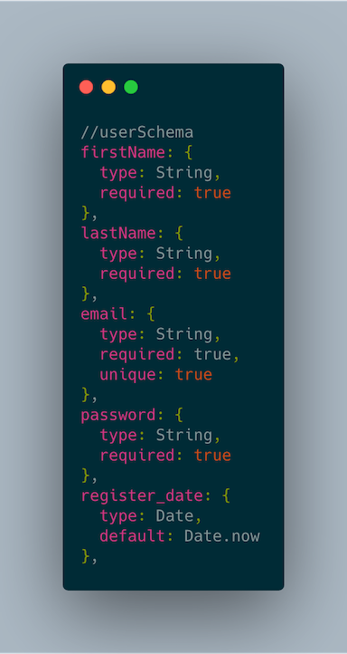
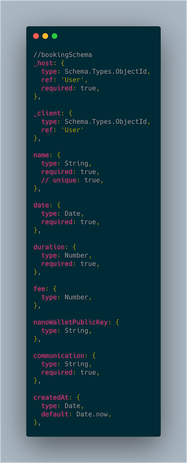
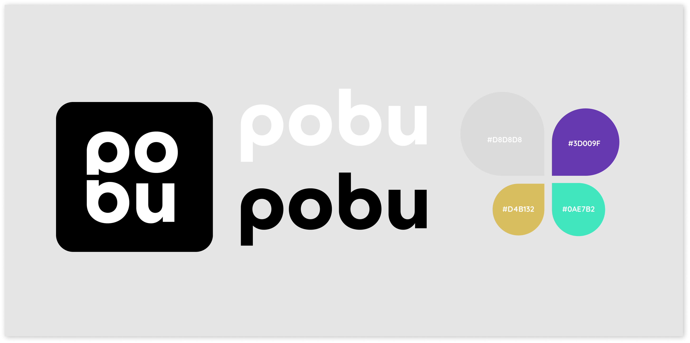

# pobu.io
*A peer-to-peer booking platform with WebRTC, Socket.IO, React, Express, Node.js and MongoDB.*


 

[Twitter](https://twitter.com/pobu_io)

[Instagram](https://instagram.com/pobu.io)

<br />

## Table of Contents

* [Getting started](#getting-started)
  * [Prerequisites](#prerequisites)
  * [Installation](#installation)
* [About project](#about-project)
  * [Problem](#problem)
  * [Solution](#solution)
* [Planning](#planning)
  * [Personas](#personas)
  * [User stories](#user-stories)
  * [Factitious Budgeting](#factitious-budgeting)
  * [Entity Relationship Diagram](#entity-relationship-diagram)
  * [Kanban](#kanban)
  * [Future](#future)
* [Visual design](#visual-design)
  * [Wireframes](#wireframes)
  * [Graphic](#graphic)
* [Team](#team)

<br />

# Getting started
These instructions will get you a copy of the project up and running on your local machine for development purposes.
### Prerequisites
#### Back-end:
- MongoDB
- Express

```json
  "dependencies": {
    "bcryptjs": "^2.4.3",
    "body-parser": "^1.19.0",
    "cors": "^2.8.5",
    "debug": "~4.1.1",
    "dotenv": "^8.0.0",
    "express": "^4.17.1",
    "jsonwebtoken": "^8.5.1",
    "moment": "^2.24.0",
    "mongoose": "^5.5.12",
    "morgan": "~1.9.1",
    "passport": "^0.4.0",
    "passport-jwt": "^4.0.0",
    "socket.io": "^2.2.0",
    "validator": "^11.0.0"
  },
```

#### Front-end:
- React

```json
  "dependencies": {
    "axios": "^0.19.0",
    "cypress": "^3.3.1",
    "history": "^4.9.0",
    "jwt-decode": "^2.2.0",
    "moment": "^2.24.0",
    "normalize.css": "^8.0.1",
    "react": "^16.8.6",
    "react-datepicker": "^2.6.0",
    "react-device-detect": "^1.6.2",
    "react-dom": "^16.8.6",
    "react-icons": "^3.7.0",
    "react-router": "^5.0.0",
    "react-router-dom": "^5.0.0",
    "react-scripts": "3.0.1",
    "react-swipeable-routes": "^0.6.0",
    "simple-peer": "^9.3.0",
    "socket.io-client": "^2.2.0"
  },
```
<br />

### Installation
Clone the repo
```
git clone https://github.com/okan-s/pobu.git
```

Change to the `api` folder and install development and production dependencies.

```
cd api
npm install
```

You will need to set up MongoDB. 
Probably would be easiest to use MongoDB Atlas. 
Enter the url in .env file located inside api folder.


Change to the `view` folder and install development and production dependencies.
```
cd view
npm install
```
In order to make WebRTC signaling work with STUN and TURN servers you need to create a account at:
http://numb.viagenie.ca/cgi-bin/numbacct
Then you need to fill in your credentials in the .env file located inside the view folder.


Go to the `api` folder and start the server.
```
cd api
npm run server
```

Go to the `view` folder and run the script start script.
```
cd view
npm run start

```

<br />

# About project

### Problem
Appointment services such as Calendly, in their current state do not provide direct communication on their platform. 
Therefore the hosts and clients are dependent on third-party solutions for communication.
We feel like that is a area that could be effectivized.
It also creates an issue of privacy for the host, because they need to share their "third-party solution" details.

### Solution
A web based application that allows clients to book appointments with hosts on our platform. 
We provide live communication on the platform so they don't have to be concered about how & where to have the meeting.
The privacy of our users is in our best interest. We promise to not sniff our users conversations. 
This repo will be public so that they can check the source code for themselves. 
Lastest changes made in the master branch automaticly deploys to our digitalocean droplet via buddy.works.

<br />

# Planning
<br />

## Personas
- Hosts
- Clients
- Users (Hosts + Clients)

<br />

## User Stories
As a User, I want to be able to register as a user on the platform, <br /> 
so that my bookables and bookings will be connected to me.<br /> 
*Acceptance criteria:*<br /> 
Be able to register as a user with first name, last name, email, password.<br /> 

As a User, I want to be see my profile details.<br /> 
*Acceptance criteria:*<br /> 
Be able to see user first name, last name, email.<br /> 

As a Host, I want to be able to create a bookable.<br /> 
*Acceptance criteria:*<br /> 
Input bookable name, date, time, duration, type of communication.<br /> 

As a User, I want to be able to see my bookables and bookings in a overview page.<br /> 
*Acceptance criteria:*<br /> 
List all bookables and bookings in a overview page.<br /> 

As a Host, I want to be able to share a created bookable to my future Client.<br /> 
*Acceptance criteria:*<br /> 
Unique url to share.<br /> 

As a Client, I want to be able to view the details of a booking and be able to accept it.<br /> 
*Acceptance criteria:*<br /> 
Show bookable details by visiting the unique url, if not already booked be able to accept it.<br /> 

As a User, I want to be able to see changes made to my bookings and bookables in realtime.<br /> 
*Acceptance criteria:*<br /> 
When a booking is accepted, update it live for both host and client without page reload.<br /> 
When a booking is deleted, remove it from overview without page reload.<br /> 
When a booking is unbooked, update it live for both host and client without page reload.<br /> 

As a User, I want to communicate with my peer in realtime when the time is in for my appointment.<br /> 
*Acceptance criteria:*<br /> 
Be able to text chat on booking page.<br /> 
Be able to video & voice chat on booking page.<br /> 

<br /> 

## Factitious Budgeting
Income:
- Transaction fees (1.25%) {lower than Klarna (1.35%) & PayPal (2.9%)}

Expenses:
- Domain (pobu.io) 350 SEK per year
- Hosting (deploys.io) [8 GB RAM] 200 SEK per month
- Office space (workaround.io) 2000 SEK per person per month

<br /> 

## Entity Relationship Diagram
 

<br />

## Kanban
- [Github Projects](https://github.com/okan-s/pobu/projects/1)

<br />

## Future plans
* When Expo SDK v33 is released, rewrite the view w/ Expo for Web.

* Time zone intelligence.

* Reusable bookables with multiple/range of avaliable dates & times.

<br />

# Visual design 

<br />

## Wireframes
 
[Link to Figma file](https://www.figma.com/file/5rzpAg2jOawC0mHHJrVnms/Wireframes-Copy?node-id=9%3A2
)

<br />

## Graphic Profile
 
[Link to Figma file](https://www.figma.com/file/5rzpAg2jOawC0mHHJrVnms/Wireframes-Copy?node-id=9%3A2
)

<br />

# Team
- [Okan](https://github.com/okan-s)
- [Esra](https://github.com/esraod)
